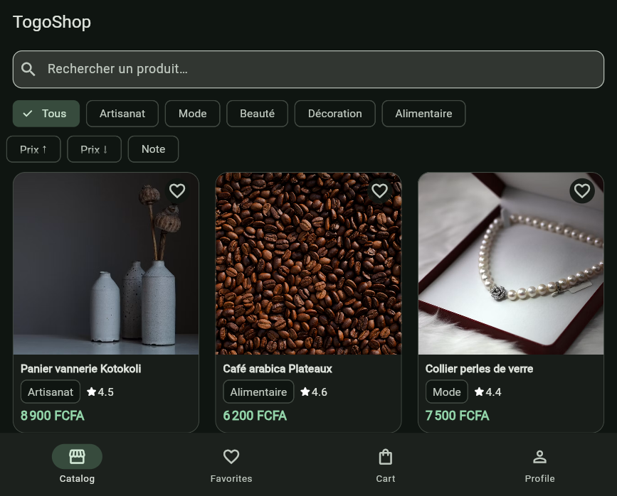
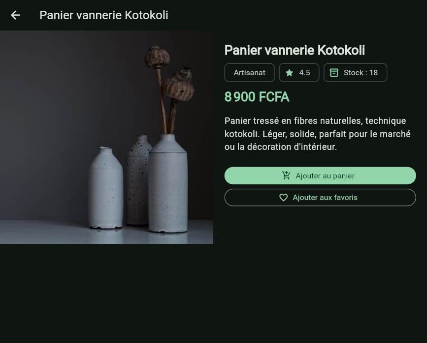
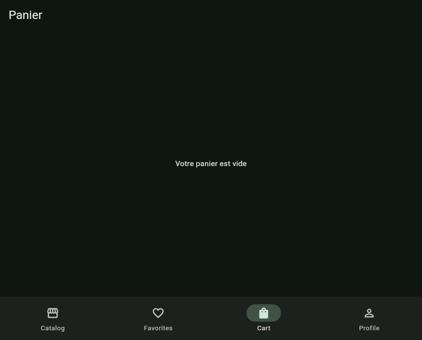
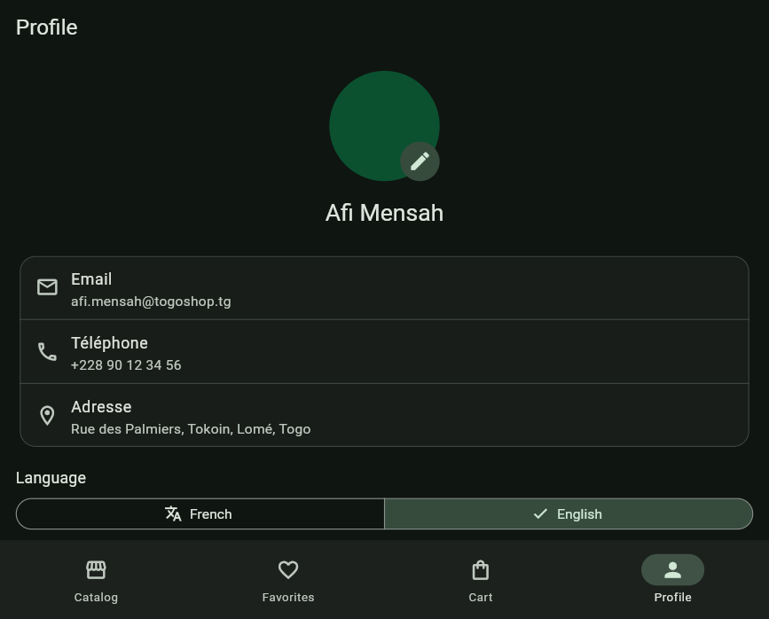

# togoshop
# TogoShop
A new Flutter project.
Application e-commerce Flutter pour les **produits artisanaux et locaux du Togo**.
## Getting Started
Le projet illustre une architecture en couches et une maîtrise de **Riverpod** : `FutureProvider`, `StateNotifierProvider`, `StateProvider`, `AsyncValue` (loading / error / data), et persistance locale avec **SharedPreferences**.
This project is a starting point for a Flutter application.
## Captures d’écran
A few resources to get you started if this is your first Flutter project:
Lancez l’app puis ajoutez vos captures dans `docs/` si vous publiez le dépôt.
- [Learn Flutter](https://docs.flutter.dev/get-started/learn-flutter)
- [Write your first Flutter app](https://docs.flutter.dev/get-started/codelab)
- [Flutter learning resources](https://docs.flutter.dev/reference/learning-resources)
## Fonctionnalités
For help getting started with Flutter development, view the
[online documentation](https://docs.flutter.dev/), which offers tutorials,
samples, guidance on mobile development, and a full API reference.
- Catalogue (image, nom, prix, catégorie, note)
- Recherche par nom
- Filtrage par catégorie (Artisanat, Mode, Beauté, Décoration, Alimentaire)
- Tri par prix croissant / décroissant / note
- Détail produit (Hero, stock, panier, favoris)
- Panier (ajout, suppression, quantités, sous-total, total, vider)
- Favoris persistés localement
- Profil utilisateur simulé + historique de commandes
- Thème Material 3 (clair / sombre / système) persisté
- Interface responsive (mobile et tablette)
# TogoShop

[](https://github.com/OWNER/REPOSITORY/actions/workflows/ci.yml)

Application e-commerce Flutter dédiée aux produits artisanaux et locaux du Togo.

## Fonctionnalités

- Catalogue avec recherche, catégories, tri, notes et stock.
- Détail produit, favoris persistés et panier avec contrôle du stock.
- Profil, historique simulé et thèmes système, clair ou sombre.
- Interface responsive sur Android, iOS, Web, Windows, macOS et Linux.
- Internationalisation française et anglaise.
- Images réseau mises en cache avec états de chargement et d’erreur.

## Architecture

L’application conserve une architecture par couches: `models` décrit les données, `repositories` charge les produits, `providers` orchestre l’état Riverpod, et `screens`/`widgets` composent l’interface. Le détail complet est disponible dans [docs/architecture.md](docs/architecture.md).

```text
assets/data/products.json -> ProductRepository -> productsProvider
									  -> filteredProductsProvider -> CatalogGrid
SharedPreferences <-> providers (favoris, profil, thème, locale)
```

## Prérequis et installation

- Flutter stable avec Dart SDK `^3.12.2`.
- Android Studio/Xcode ou les toolchains desktop selon la cible.

```bash
flutter pub get
flutter run
```

Les URL d’images de démonstration nécessitent une connexion réseau. Les données produit restent locales.

## Qualité et tests

```bash
dart format --output=none --set-exit-if-changed lib test integration_test
flutter analyze
flutter test
flutter test integration_test/app_test.dart -d <android-device>
```

La suite contient 19 tests unitaires et 5 tests widgets. Les deux tests d’intégration s’exécutent sur émulateur Android dans GitHub Actions. Flutter ne supporte pas l’exécution de `integration_test` avec `-d chrome` dans l’environnement actuel.

## Builds

```bash
flutter build apk --release
flutter build web --release
flutter build windows --release
flutter build macos --release
flutter build ios --release --no-codesign
flutter build linux --release
```

Les builds Apple nécessitent macOS/Xcode. Une IPA signée nécessite des certificats Apple et n’est pas stockée dans le dépôt.

## Captures

Les captures du build Web sont disponibles dans [docs/screenshots/](docs/screenshots/):

| Catalogue | Détail produit |
| --- | --- |
|  |  |

| Panier | Profil et langue |
| --- | --- |
|  |  |

Voir [docs/screenshots/README.md](docs/screenshots/README.md) pour les consignes de mise à jour.

## Licence

Projet de démonstration pédagogique, libre d’usage pour un dépôt GitHub public.